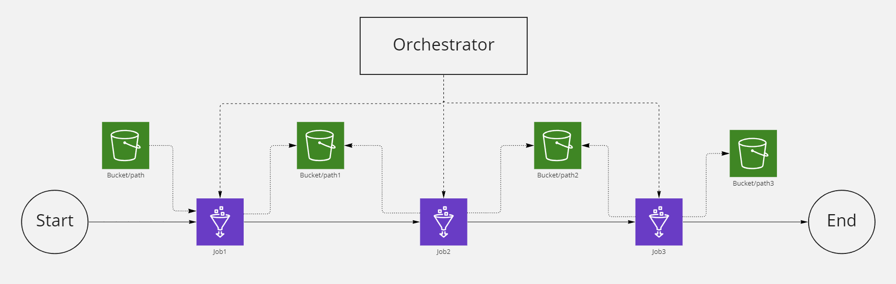
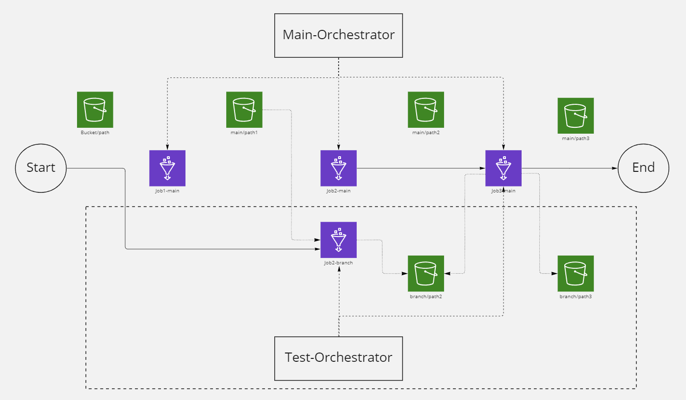
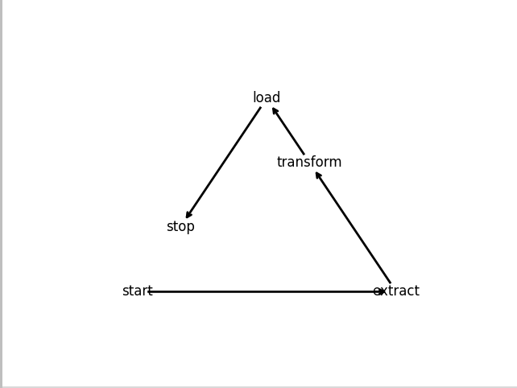
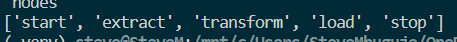
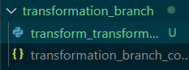
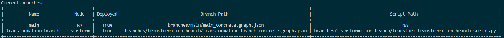
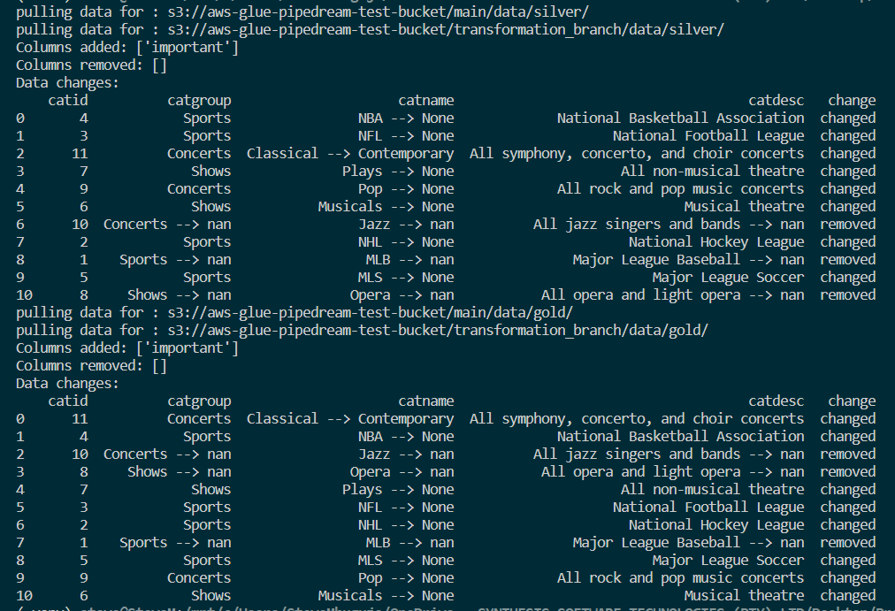

# Pipedream

Pipedream is a tool that makes it easy to work on AWS glue pipelines without running the risk of breaking production data or code while keeping costs and operational overhead to a minimum.

## Background?

Data pipelines in AWS usually take the form of a series of S3 buckets that represent the stages of the data as it flows through a data pipeline.
The pipeline then has a series of AWS Glue Jobs that reads the data from a bucket and transforms the data in some way before it writes it to another bucket.
These jobs need to be executed in order and each job is dependent on all previous jobs executing correctly and completely before it can execute.
To facilitate this execution scheduling and dependency management, and orchestration tool such as AWS step functions, or Apache Airflow is utilized.
An example of a very simple data pipeline architecture can be seen in the image below:



It is important to note that a pipeline can be much more complex than the simple one above and the flow of the data though the pipeline often represents a complex graph with many jobs triggering multiple downstream jobs and some jobs might be dependent on multiple previous jobs.

## What problem is this solving?

Working on these pipelines can be very difficult because creating a dev environment in the cloud that has representative datasets can be very expensive as the datasets can be very big and expensive to replicate.
Even if pipeline developers have a dev environment at their disposal, they would still share the pipeline and because of the highly interconnected nature of these pipelines, breaking the pipelines or the data would mean that other developers who are working on downstream jobs might be affected.
It can also be prohibitively expensive and difficult to allow each developer to have their own environment to develop and test on.

These issues often lead to development happening directly on the production pipeline.
This usually takes the form of spinning up dev resources and data in the production environment which are often forgotten and incurs costs, as well as make the production environment difficult to keep clean and maintain.
If changes happen directly on the production pipeline, simple development mistakes can often lead to production data being affected.
It can also lead to un-audited code changes running directly in the production pipeline which other developers might not have access to and the pipelines quickly become unmaintainable.
The above issues make data pipelines very hard to scale and maintain, data becomes unstable and unreliable, and ultimately leads to failure of data projects.

## How does pipedream solve these issues?

Pipedream solves these issues by allowing each developer to duplicate the node in the pipeline that they are working on, and then automatically creating a custom orchestration of the pipeline that uses the development node as a starting node, and re-orchestrating all subsequent nodes in the pipeline so that all data created by the duplicated job, and all subsequent jobs remain completely separated from the main production data.
Pipedream does this by only deploying the development node, and the custom orchestrator, no additional resources are deployed.
The custom orchestrator also only orchestrates jobs that would be affected by the custom changes so no unnecessary processing happens in the pipeline.
The process of deploying a development job and an orchestrator is called branching.
An example of the environment after pipedream has deployed a development pipeline can be seen in the image below:



Because Pipedream has a handle on both the data from the main data pipeline, as well as the data generated by the development pipeline, it can generate reports on how the proposed changes affected the downstream data before the changes get deployed.
Once the developer is satisfied with the changes, the code can be handled through the normal source-control and deployment strategy.
Finally pipedream will destroy all the resources that it created for the test environment, as well as all data generated by the development pipeline, leaving the production environment clean.

## Future Work

There are many ways in which Pipedream can be improved to provide a better development experience, and the hope is that more adoption would justify additional development work on this tool.
Some of the areas where we can see development happening are:

1. Because Pipedream sits on top of your existing orchestration tool, it could in the future only use representative subsets of your production data to test pipelines, further reducing costs and development time.
2. Currently it is also heavily focussed on AWS Services and specifically AWS Glue, but future work could provide integrations with other services and orchestrators.
3. In order for pipedream to dynamically deploy jobs and orchestrate a development pipeline, it needs to have an internal representation of the graph that represents the pipeline as well as the information needed to deploy certain nodes. This requires that this internal graph needs to be kept up to date with what is currently deployed to production. 
At the moment pipedream can import the configuration of the production glue jobs, but future work would allow for pipedream to look at your current orchestration tool to automatically build an internal graph representation of your current environment. This would mean that pipedream introduces very little additional development overhead.

## Building an abstract main graph

In order for pipedream to deploy a re-orchestrated data pipeline to your cloud environment, it needs to have an abstract representation of your data pipeline.
This abstract view of the data pipeline is called the main abstract graph and it serves as a template that can be used to generate the job names and data paths for the 

```
{branch-name}
```

Defining output data paths
```
"output_data": {
            "bronze": "s3://aws-glue-pipedream-test-bucket/{branch-name}/data/bronze/"
          },
```

```
BRONZE_DATA_SOURCE
BRONZE_DATA_SINK
```

Defining links
```
{
      "source": "extract",
      "target": "transform",
      "directed": true,
      "metadata": {
        "data": ["bronze"],
        "crawl_data": false
      }
    }
```


## CLI commands

### Visualize graph of main pipeline

`python pipedream.py plot`

### Check existing nodes/jobs in the pipeline

`python pipedream.py nodes`

### Import branch

`python pipedream.py import-dag job_name`

### Check all branches

`python pipedream.py branches`

### Create a new branch

`python pipedream.py create-branch node_name {new_branch_name}`

### Deploy branch

`python pipedream.py deploy-branch {new_branch_name}`

### Generate deltas between the main branch and newly create branch (new_branch)

`python pipedream.py deltas {new_branch_name}`

### Destroy deployed new_branch

`python pipedream.py destroy-branch {new_branch_name}`

### Destroy local new_branch

`python pipedream.py delete-branch {new_branch_name}`


## A Quick Tutorial to help get you started 

Step 1: Getting pipedream.

1.	Clone the repo. 

Step 2: Setting up the workspace.

1.	Create a python virtual environment.
2.	Install the requirements.txt.
3.	Export your aws credentials into the terminal.

Step 3: Workflow.

1.	Deploy your infrastructure or import your pipeline
2.	Visual your pipeline using “python pipedream.py plot” command. This command will your pipeline in a graph.


3.	Check existing nodes/jobs in the pipeline using the “python pipedream.py nodes” command. This command will showcase all the different nodes in your pipeline that you can also branch off from.  


4.	Create a new branch of a node of your choice using the “python pipedream.py create-branch node_name new_branch” command. The node_name will be replaced with the node you wish to branch off from and new_branch with be the name of the new branch. After creating the new branch a new directory with the name of your branch will be created in the branches directory. Inside the new directory will be a graph of the branch and the script of the node you branched off from.


5.	Deploy your branch us the “python pipedream.py deploy-branch new_branch” command. 
6.	Use the “python pipedream.py branches” to check all the branches that been created as well as the main branch.


7.	Use the “python pipedream.py deltas new_branch” to check the changes between the main branch and the new branch you have created. This command will also generate a report about the changes.



8.	Use the “python pipedream.py destroy-branch new_branch” to destroy a deployed branch.
9.	Use the “python pipedream.py delete-branch new_branch” to delete a local branch. 

